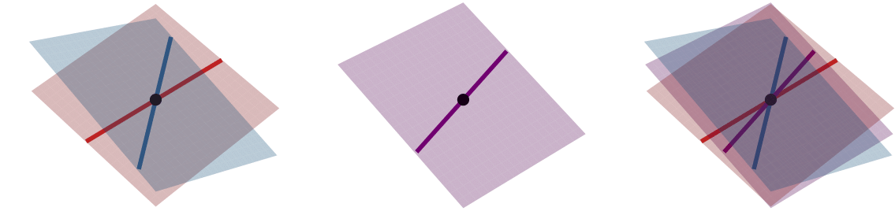

# Chordal Flag Averaging

## Description

This is the code for the chordal flag-mean and flag-median presented in [Chordal Averaging on Flag Manifolds and Its Applications](https://openaccess.thecvf.com/content/ICCV2023/papers/Mankovich_Chordal_Averaging_on_Flag_Manifolds_and_Its_Applications_ICCV_2023_paper.pdf).



### Abstract
This paper presents a new, provably-convergent algorithm for computing the flag-mean and flag-median of a set of points on a flag manifold under the chordal metric. The flag manifold is a mathematical space consisting of flags, which are sequences of nested subspaces of a vector space that increase in dimension. The flag manifold is a superset of a wide range of known matrix spaces, including Stiefel and Grassmanians, making it a general object that is useful in a wide variety computer vision problems.

To tackle the challenge of computing first order flag statistics, we first transform the problem into one that involves auxiliary variables constrained to the Stiefel manifold. The Stiefel manifold is a space of orthogonal frames, and leveraging the numerical stability and efficiency of Stiefel-manifold optimization enables us to compute the flag-mean effectively. Through a series of experiments, we show the competence of our method in Grassmann and rotation averaging, as well as principal component analysis.

### How to Cite

```Bibtex
@InProceedings{Mankovich_2023_ICCV,
    author    = {Mankovich, Nathan and Birdal, Tolga},
    title     = {Chordal Averaging on Flag Manifolds and Its Applications},
    booktitle = {Proceedings of the IEEE/CVF International Conference on Computer Vision (ICCV)},
    month     = {October},
    year      = {2023},
    pages     = {3881-3890}
}
```


## Getting Started

### Dependencies

See `requirements.txt` for Python dependencies. Was built with Python 3.8.8.

### Quick Start (Python)

1. Initialize conda environment

    ```
    conda create --name chordal_flag_averaging python=3.8.8
    conda activate chordal_flag_averaging
    ```

1. Install requirements

    ```
    pip install -r ./PythonCode/requirements.txt
    ```

1. Open `./GettingStarted/example.ipynb` and run it within the `chordal_flag_averaging` environment.

`example.ipynb` shows how to compute:

* chordal flag mean
* chordal flag median


## Authors

Nathan Mankovich and Tolga Birdal: [email](mailto:nathan.mankovich@gmail.com)

